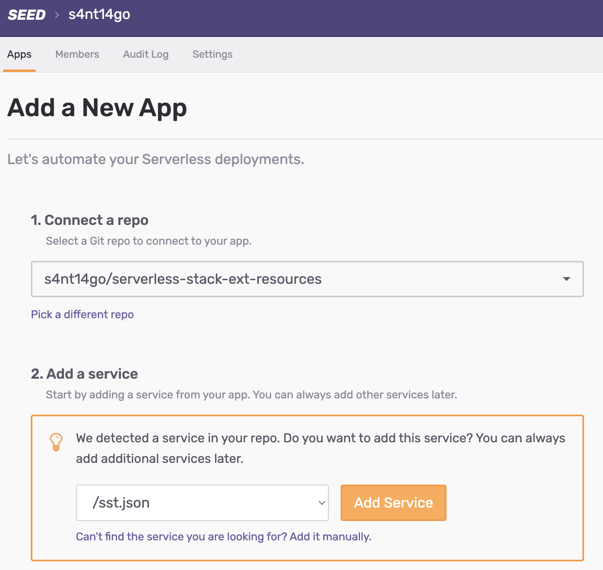
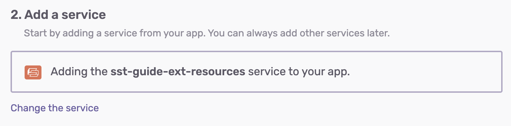
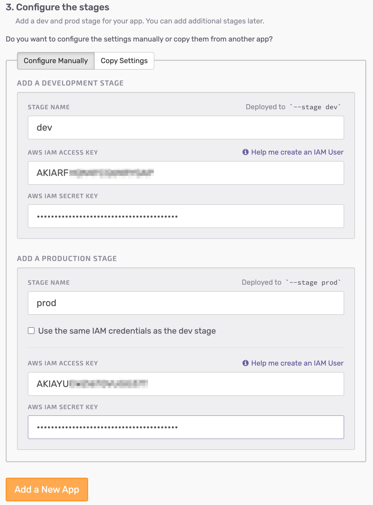
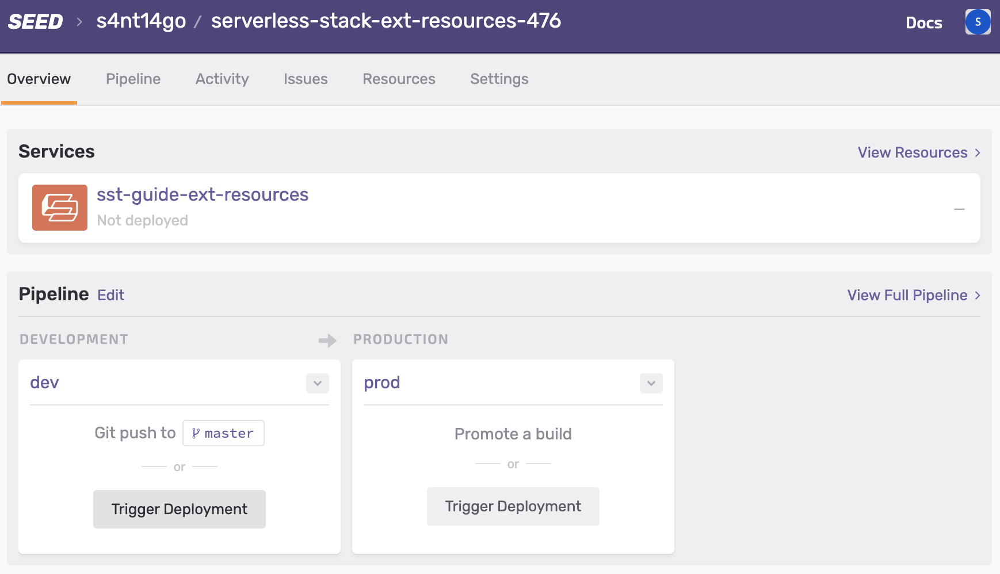
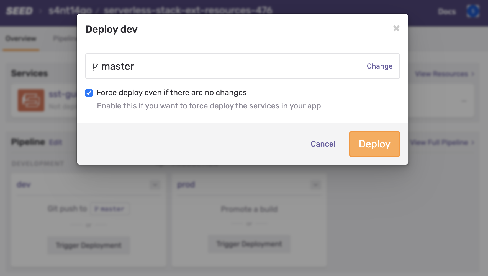
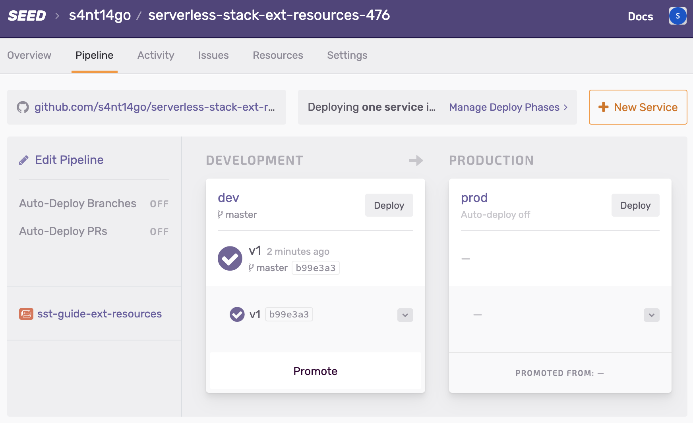
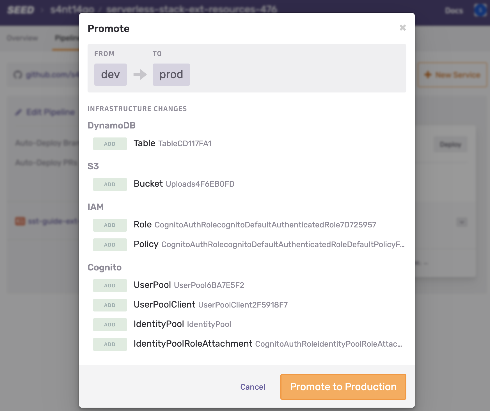
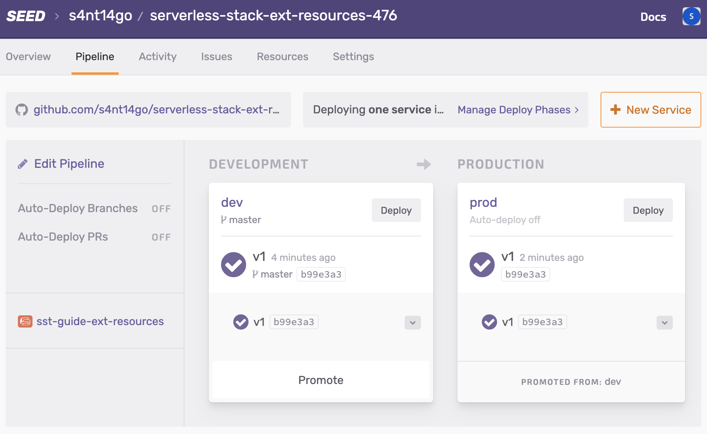

## Backend [SST guide](https://sst.dev/guide.html)

This implementation is based on an SST guide extended version which included chapters "Best Practices" and "Extra Credit". 

Actually the backend consists of:

* [Infrastructure](https://github.com/s4nt14go/serverless-stack-ext-resources) (this repo): Deploys S3, DynamoDB & Cognito, it doesn't change a lot and can be shared between several Serverless API stages. It uses [AWS CDK](https://aws.amazon.com/cdk) with [SST](https://github.com/serverless-stack/serverless-stack) for deployment.
* [API](https://github.com/s4nt14go/serverless-stack-ext-api): Deploys API Gateway and Lambdas, most of the development iterations are done on this repo. It uses [Serverless Framework](https://github.com/serverless/serverless) for deployment.

For the frontend and the demo link check [this repo](https://github.com/s4nt14go/serverless-stack-client)

## Instructions:

Node version 14 used for development, using [nvm](https://github.com/nvm-sh/nvm) you can:
```
# set Node 14 in current terminal
nvm use 14
# set Node 14 as default (new terminals will use 14)
nvm alias default 14
```
* Install dependencies: `npm install`
* Deploy infrastructure: `npm run deploy`

As these resources are used by [API](https://github.com/s4nt14go/serverless-stack-ext-api), first delete that API and you can do the cleanup: `npm run delete`

### SEED walkthrough

[SEED](https://seed.run) is used for the deployment pipeline, here follows a walkthrough of the configuration steps

<p align="center">
    
</p>
<p align="center">
    
</p>

We use an account for `dev` and a different one for `prod`:

<p align="center">
    
</p>
<p align="center">
    
</p>
<p align="center">
    
</p>
<p align="center">
    
</p>
<p align="center">
    
</p>
<p align="center">
    
</p>
